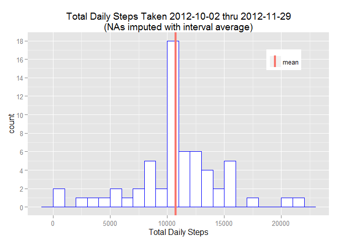
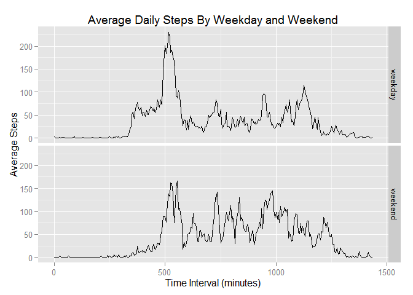

# Reproducible Research: Peer Assessment 1

## Loading and preprocessing the data


```r
library(downloader)
library(utils)

dataDir <- "data"
if(!file.exists(dataDir)) {
    dir.create(file.path(".", dataDir))
} else {
    unlink(file.path(".", dataDir), recursive = TRUE)
    dir.create(file.path(".", dataDir))
}
#fileUrl <- "https://d396qusza40orc.cloudfront.net/repdata%2Fdata%2Factivity.zip"
fileUrl <- paste0("https://github.com/MichaelSzczepaniak/",
                  "RepData_PeerAssessment1/raw/master/activity.zip")
renameZipTo <- "data.zip"
renameDataTo <- "data.csv"
download(fileUrl, file.path(".", dataDir, renameZipTo))
# get the name of the data file from zip archive
zipFiles <- unzip(file.path(".", dataDir, renameZipTo), list = TRUE)
csvFile <- zipFiles$Name[1] # there should only be one file in this zip archive
# unzip to the data directory
unzip(file.path(".", dataDir, renameZipTo), exdir = file.path(".", dataDir))
dataFiles <- list.files(file.path(".", dataDir))
success <- file.rename(file.path(".", dataDir, csvFile),
                       file.path(".", dataDir, renameDataTo))
# read the data file to a data.frame
activity.data <- read.csv(file.path(".", dataDir, renameDataTo), header = TRUE)
```
  
## What is mean total number of steps taken per day?


```r
library(ggplot2)
suppressMessages(suppressWarnings(require(dplyr)))
options(scipen = 3, digits = 2)
activity.data.nonas <- filter(activity.data, !is.na(steps))

getDailySteps <- function(act.data) {
    suppressMessages(suppressWarnings(require(dplyr)))
    activity.byday <- group_by(act.data, date)
    activity.summ <- summarize(activity.byday, Total.Steps = sum(steps),
                               Mean.Steps = mean(steps))
    
    return(activity.summ)
}

activity.summ <- getDailySteps(activity.data.nonas)
steps.mean <- mean(activity.summ$Total.Steps)
steps.median <- median(activity.summ$Total.Steps)

## Creates a historgram from the following parameters:
##
createHistogram <- function(plot.data, x.data, bar.outline.color, bar.fill,
                            bin.size, y.breaks, plot.title, x.label) {
    # Use aes_string to pass column by name as a string:
    # http://stackoverflow.com/questions/15458526
    p <- ggplot(plot.data, aes_string(x = x.data))
    p <- p + geom_histogram(colour=bar.outline.color, fill=bar.fill,
                            binwidth=bin.size)
    p <- p + scale_y_continuous(breaks=y.breaks)
    p <- p + ggtitle(plot.title)
    p <- p + labs(x = x.label)
    # add vertical line for mean and median
    print(p)
}
title <- "Total Daily Steps Taken 2012-10-02 thru 2012-11-29"
createHistogram(activity.summ, "Total.Steps", "darkgreen", "white",
                1000, seq(0, 11, 1), title, "Total Daily Steps")
```

 

The **mean** number of steps taken per day was 10766.19  
The **median** number of steps taken per day was 10765  

## What is the average daily activity pattern?

The **interval** field of the activity data records a data point every 5 
minutes, but when it gets to 55, it jumps to 100 in order to designate that an 
hour has passed.  Leaving the data in this form would create gaps in the 
time series plot of the averages, the following code normalizes these value 
to remove these gaps


```r
## Converts the interval field to the actual accumulated time. E.g. if interval
## value is 105, the actual value is 65 accumulated minutes.
normalizeInterval <- function(df = activity.data.nonas) {
    activity.nonas.norm.time <- data.frame(steps = df$steps,
                                           date = df$date,
                                           interval = df$interval)
    for(i in 2:length(df$interval)) {
        if(df$interval[i] >= 100) {
            hours <- trunc(df$interval[i] / 100)
            mins <- df$interval[i] - (hours * 100)
            activity.nonas.norm.time$interval[i] <- (hours * 60) + mins
        }
    }
    
    return(activity.nonas.norm.time)
}

interval <- seq(0, 1435, by = 5)
time.series.df <- data.frame(interval = interval,
                             average.steps = rep(-1, length(interval)))
normalized.activity <- normalizeInterval()
for(i in 1:length(interval)) {
    intervalSteps <- filter(normalized.activity, interval == interval[i])
    time.series.df$average.steps[i] <- mean(intervalSteps$steps)
}
```

With the gaps removed, the code below uses the **ggplot2** package to generate the 
line plot (point symbols omitted):  


```r
p2 <- ggplot(time.series.df, aes(x = interval, y = average.steps))
p2 <- p2 + ggtitle("Average Daily Steps Per 5-Minute Time Interval")
p2 <- p2 + labs(x = "Interval", y = "Average Steps")
#p2 <- p2 + geom_point(size = 2)
p2 <- p2 + geom_line()
print(p2)
```

 
  
The following code finds the 5-minute interval with the maximum number of 
steps:  
  

```r
indexOfMax <- which.max(time.series.df$average.steps)
maxInterval <- time.series.df$interval[indexOfMax]
maxSteps <- time.series.df$average.steps[indexOfMax]
```

The 5-minute interval where the maximum number of steps are taken is 
515.  The maximum of average steps in the data was 206.17
  
## Imputing missing values  
### Number of missing (NA) values in the **steps** field.
#### (*Note: There are no missing values in the **date** or **interval** fields.*)

```r
sum(is.na(activity.data$steps))
```

```
## [1] 2304
```

### Missing values in the **steps** field were imputed using the average value for steps in that particular interval.


```r
# normalize the interval field as was done before
activity.data.normalized <- normalizeInterval(activity.data)

## Returns the value of average.steps for given interval.value
getAverageSteps <- function(interval.value, df.with.averages = time.series.df) {
    indexOfInterval <- which(df.with.averages$interval == interval.value)
    return(df.with.averages$average.steps[indexOfInterval])
}

# Iterate through the normalized activity data and replace NAs with averages
# for the particular interval
for(i in 1:length(activity.data.normalized$interval)) {
    if(is.na(activity.data.normalized$steps[i])) {
        activity.data.normalized$steps[i] <- 
            getAverageSteps(activity.data.normalized$interval[i])
    }
}

# generate the second histogram
daily.steps <- getDailySteps(activity.data.normalized)
t <- "Total Daily Steps Taken 2012-10-02 thru 2012-11-29"
t <- paste0(t, "\n(NAs imputed with interval average)")
createHistogram(daily.steps, "Total.Steps", "blue", "white",
                1000, seq(0, 20, 2), t, "Total Daily Steps")
```

 

```r
# calculate the new mean and median values
mean.imp <- mean(daily.steps$Total.Steps)
median.imp <- median(daily.steps$Total.Steps)
```
  
After imputting NAs, **mean** number of steps taken per day = 10766.19  
After imputing NAs, **median** number of steps taken per day = 10766.19

Imputting the NAs in the way described above did not change the value of the 
**mean**.  The **median** value changed only slightly because it was already 
very close to the mean.  The only noticable change is the lengthening of the bin 
containing the mean in the histogram.  These results were to be expected since 
we added more mean values to the data. 
  
## Are there differences in activity patterns between weekdays and weekends?

```r
isWeekday <- function(date.yyyy.mm.dd) {
    d <- as.POSIXlt(date.yyyy.mm.dd)
    if(d$wday %in% c(1:5)) {
        return("weekday")
    }
    else {
        return("weekend")
    }
}

activity.data.normalized$day.type <-
    sapply(activity.data.normalized$date, isWeekday)

activity.data.normalized <- mutate(activity.data.normalized,
                                   day.type = as.factor(day.type))

interval <- seq(0, 1435, by = 5)
time.series.df.imputed <-
    data.frame(interval = interval,
               day.type = as.factor(c(rep("weekday", length(interval)),
                                      rep("weekend", length(interval)))),
               average.steps = rep(-1, 2 *length(interval)))

stepsWeekdays <- filter(activity.data.normalized, day.type == "weekday")
for(i in 1:length(interval)) {
    intervalStepsWeekdays <- filter(stepsWeekdays, interval == interval[i])
    time.series.df.imputed$average.steps[i] <- 
        mean(intervalStepsWeekdays$steps)
}

stepsWeekends <- filter(activity.data.normalized, day.type == "weekend")
j.start <- length(interval) + 1
for(j in j.start:(2*length(interval))) {
    intervalStepsWeekends <- filter(stepsWeekends, interval == interval[j])
    time.series.df.imputed$average.steps[j] <- 
        mean(intervalStepsWeekends$steps)
}

g <- ggplot(time.series.df.imputed,
            aes(x = interval, y = average.steps, fill = day.type))
g <- g + geom_line()
g <- g+ facet_grid(day.type ~ .)
print(g)
```

 
