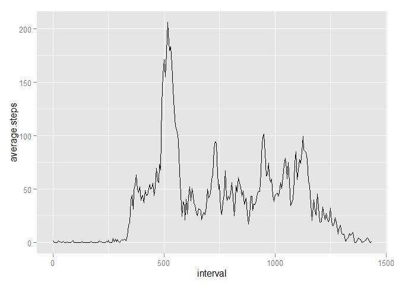

# Reproducible Research: Peer Assessment 1

## Loading and preprocessing the data


```r
library(downloader)
library(utils)
library(ggplot2)
dataDir <- "data"
if(!file.exists(dataDir)) {
    dir.create(file.path(".", dataDir))
} else {
    unlink(file.path(".", dataDir), recursive = TRUE)
    dir.create(file.path(".", dataDir))
}
#fileUrl <- "https://d396qusza40orc.cloudfront.net/repdata%2Fdata%2Factivity.zip"
fileUrl <- paste0("https://github.com/MichaelSzczepaniak/",
                  "RepData_PeerAssessment1/raw/master/activity.zip")
renameZipTo <- "data.zip"
renameDataTo <- "data.csv"
download(fileUrl, file.path(".", dataDir, renameZipTo))
zipFiles <- unzip(file.path(".", dataDir, renameZipTo), list = TRUE)
csvFile <- zipFiles$Name[1] # there should only be one file in this zip archive
unzip(file.path(".", dataDir, renameZipTo), exdir = file.path(".", dataDir))
dataFiles <- list.files(file.path(".", dataDir))
success <- file.rename(file.path(".", dataDir, csvFile),
                       file.path(".", dataDir, renameDataTo))
activity.data <- read.csv(file.path(".", dataDir, renameDataTo), header = TRUE)
```
### Number of NA values in the **steps** field

```r
sum(is.na(activity.data$steps))
```

```
## [1] 2304
```
### Number of records that have (non-NA) values in the **steps** field


```r
length(activity.data$steps) - sum(is.na(activity.data$steps))
```

```
## [1] 15264
```
## What is mean total number of steps taken per day?


```r
options(scipen = 3, digits = 2)
suppressMessages(suppressWarnings(require(dplyr)))
activity.data.nonas <- filter(activity.data, !is.na(steps))
activity.byday <- group_by(activity.data.nonas, date)
activity.summ <- summarize(activity.byday, Total.Steps = sum(steps),
                                           Mean.Steps = mean(steps))
steps.mean <- mean(activity.summ$Total.Steps)
steps.median <- median(activity.summ$Total.Steps)
#hist(activity.summ$Total.Steps) # base plotting system
p <- ggplot(activity.summ, aes(x = Total.Steps))
p <- p + geom_histogram(colour = "darkgreen", fill = "white", binwidth = 1000)
p <- p + scale_y_continuous(breaks=seq(0, 11, 1))  # Ticks from 0-11, every 1
p <- p + ggtitle("Total Daily Steps Taken 2012-10-02 thru 2012-11-29")
p <- p + labs(x = "Total Daily Steps")
# add vertical line for mean and median
print(p)
```

 

The mean number of steps taken per day was 10766.19  
The median number of steps taken per day was 10765  

## What is the average daily activity pattern?

The **interval** field of the activity data records a data point every 5 
minutes, but when it gets to 55, it jumps to 100 in order to designate that an 
hour has passed.  Leaving the data in this form would create large gaps in the 
time series plot of the averages, the following code normalizes these value 
to remove these gaps


```r
activity.nonas.norm.time <- data.frame(steps = activity.data.nonas$steps,
                                       date = activity.data.nonas$date,
                                       interval = activity.data.nonas$interval)
for(i in 2:length(activity.data.nonas$interval)) {
    if(activity.data.nonas$interval[i] >= 100) {
        hours <- trunc(activity.data.nonas$interval[i] / 100)
        mins <- activity.data.nonas$interval[i] - (hours * 100)
        activity.nonas.norm.time$interval[i] <- (hours * 60) + mins
    }
}
interval <- seq(0, 1435, by = 5)
time.series.df <- data.frame(interval = interval,
                             average.steps = rep(-1, length(interval)))
for(i in 1:length(interval)) {
    intervalSteps <- filter(activity.nonas.norm.time, interval == interval[i])
    time.series.df$average.steps[i] <- mean(intervalSteps$steps)
}
```
This section acts as test: REMOVE BEFORE FINAL CHECK-IN  
interval = 0  has average steps = 1.72 should be  1.7  
interval = 5  has average steps = 0.34 should be 0.34  
interval = 10 has average steps = 0.13 should be 0.13  


```r
p2 <- ggplot(time.series.df, aes(x = interval, y = average.steps))
p2 <- p2 + geom_point(size = 2) + geom_line()
print(p2)
```

 

## Imputing missing values


## Are there differences in activity patterns between weekdays and weekends?
